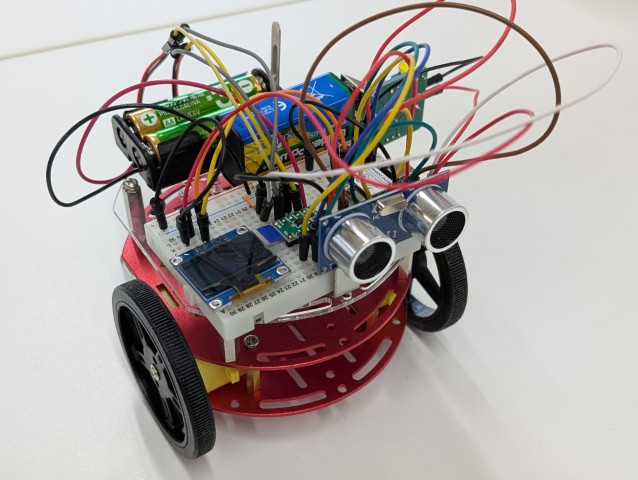

# ESP32 robot-car

**Seeed Studio XIAO ESP32シリーズ** を搭載した小型二輪ロボットカーのプロジェクトです。

## 基本ハードウェア構成

* **マイコン**: Seeed Studio XIAO ESP32C6
* **ディスプレイ**: SSD1306 0.96インチ OLED (I2C接続)
* **センサー**: HC-SR04 超音波距離センサー
* **モータードライバ**: Hブリッジモータードライバ (2モーター制御用)
* **モーター**: DCモーター x 2 (左車輪・右車輪)

[部品表](BOM.md)

[回路図](esp32-mouse-rev03-xiao-esp32c6.pdf)

## 基本ソフトウェア構成

### Arduino IDE
* [Arduinoスケッチ](Arduino/README.md)

### 必須ライブラリ
Arduino IDEのライブラリマネージャから以下のライブラリをインストールしてください。

* **Adafruit GFX Library**
* **Adafruit SSD1306**
* **Ticker** (ESP32標準搭載)

## 外観

### 基本ロボットカー

### AI搭載ロボットカー

